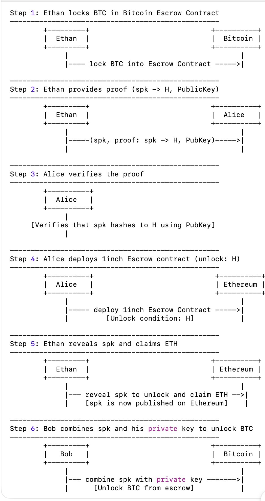

### Atomic Swap between Bitcoin <-> Ethereum

This project demonstrates an atomic swap protocol between Bitcoin and Ethereum, enabling trustless, cross-chain asset exchanges. It implements concepts from [2402.16735: Multichain Taprootized Atomic Swaps](https://arxiv.org/abs/2402.16735), and draws inspiration from [1inch's fusion-resolver-example](https://github.com/1inch/fusion-resolver-example) and [distributed-lab's taprootized-atomic-swaps](https://github.com/distributed-lab/taprootized-atomic-swaps). The implementation showcases private swaps using Taproot on Bitcoin and smart contracts on Ethereum.



#### Prerequisites

Make sure you have the following installed:

- [anvil](https://book.getfoundry.sh/anvil/) (Ethereum local testnet)
- [bitcoind](https://bitcoin.org/en/download) (Bitcoin full node)
- [sp1](https://github.com/succinctlabs/sp1) (Succinct Prover)
- [Rust](https://www.rust-lang.org/tools/install)
- [npx](https://nodejs.dev/en/learn/the-npx-nodejs-package-runner/) (comes with Node.js)


#### Run the demo

```bash
just stop
just start
just monitor
just balance
just deploy-btc
just prove
just verify
just maker
just taker
just balance
just withdraw 
just balance
```